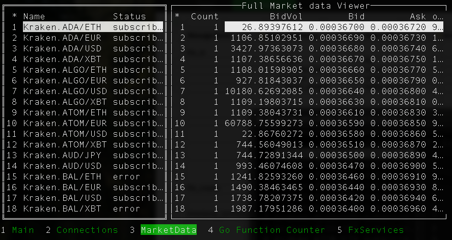

# Kraken Market Data Application

This is a CLI style application that uses golang to connect to a webservice to extract crypto market data

This application connects to the Kraken Website (https://www.kraken.com/) and it can retrieve Market Data from their website, via WebSocket interface.

# Pre-requisites
1. Golang version 1.24

# To install
1. Create a folder, for the source code
2. Clone the repo
3. Run go install

# Run application

Here is a screenshot of a running application.

To start the market feed, scroll to the FxServices screen, and active all the services.
The Client Connection Manager is a listener port for the goMarketData (https://github.com/bhbosman/gomarketdata) application to connect to.
This goMarketData collate data from other services, such as the kraken-stream application(https://github.com/bhbosman/gokraken).

